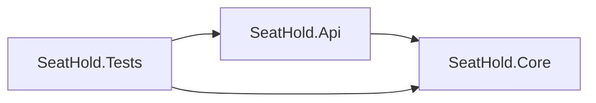
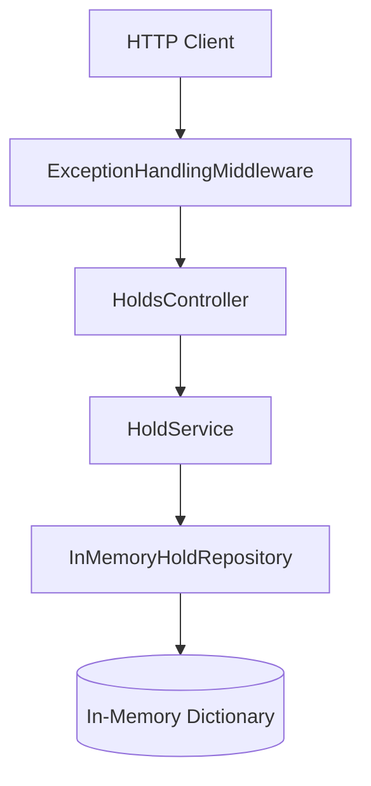
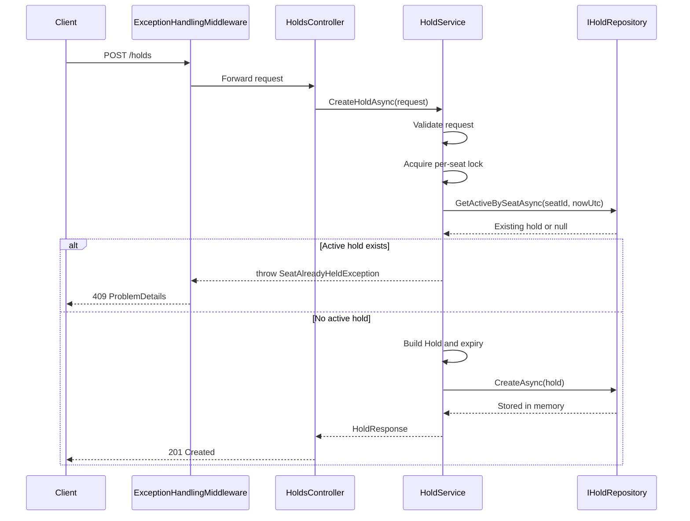
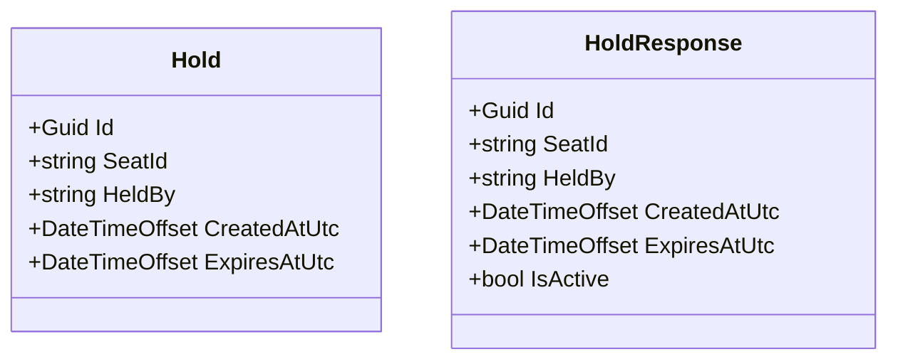

# SeatHoldApi Architecture

## Overview

`SeatHoldApi` is a small ASP.NET Core 8 Web API centered on one business capability: creating and reading temporary seat holds.

This branch is the simple in-memory version of the application. The active solution contains three projects:

- `SeatHold.Api`
- `SeatHold.Core`
- `SeatHold.Tests`

The dependency direction is intentionally narrow:

`Api -> Core`

Tests reference both runtime projects, but production code stays layered and easy to follow.

## Runtime Shape

At runtime, the request pipeline is thin:

- ASP.NET Core receives the request
- exception middleware translates known domain failures into `ProblemDetails`
- the controller delegates to the service
- the service applies business rules
- the in-memory repository stores and reads hold data

## Projects

### SeatHold.Api

`SeatHold.Api` is the host application. It owns:

- app startup in `Program.cs`
- dependency injection registration
- HTTP endpoints in `HoldsController`
- exception-to-response mapping in `ExceptionHandlingMiddleware`
- Swagger/OpenAPI setup

The public endpoints are:

- `POST /holds`
- `GET /holds/{id}`
- `GET /holds?status=active|expired`

Controllers are intentionally thin. They do basic request/query handling and leave business logic to the service layer.

### SeatHold.Core

`SeatHold.Core` contains the business logic and all core abstractions.

It includes:

- request/response contracts
- the `Hold` domain model
- service interfaces and `HoldService`
- repository abstraction `IHoldRepository`
- `InMemoryHoldRepository`
- domain exceptions
- `ISystemClock` and `SystemClock`

This is where the real behavior lives:

- request validation
- trimming `SeatId` and `HeldBy`
- calculating `CreatedAtUtc` and `ExpiresAtUtc`
- computing `IsActive` as derived state
- enforcing that only one active hold may exist for a seat

`HoldService` also uses a per-seat `SemaphoreSlim` keyed by seat id to serialize concurrent create requests inside a single process.

### SeatHold.Tests

`SeatHold.Tests` covers both the business logic and the HTTP surface.

It is split into:

- unit tests for `HoldService`
- integration tests using `WebApplicationFactory<Program>`

The unit tests use:

- `InMemoryHoldRepository`
- a fake clock

That keeps time-sensitive behavior deterministic and fast to verify.

The integration tests exercise the real API pipeline end to end, including routing, middleware, DI, and JSON serialization.

## Core Flow

The main write path is straightforward and stays easy to reason about.

Reads are simpler:

- `GetHoldAsync` returns a single hold or `null`
- `GetHoldsAsync` returns all, active-only, or expired-only
- `IsActive` is always computed from `ExpiresAtUtc` against the current UTC clock

## Data Model

The runtime data model is intentionally minimal.

Important detail:

- `IsActive` is not stored anywhere
- it is derived from `ExpiresAtUtc > nowUtc`

That keeps the model clean and avoids persisting state that can drift.

## Error Handling

Known business failures are translated centrally by `ExceptionHandlingMiddleware`:

- `InvalidHoldRequestException` -> `400 Bad Request`
- `SeatAlreadyHeldException` -> `409 Conflict`
- any unexpected exception -> `500 Internal Server Error`

Known errors return `ProblemDetails`, so controllers do not need repeated try/catch code.

## Lifetime and State

On this branch, the repository is registered as a singleton and backed by a process-local `ConcurrentDictionary<Guid, Hold>`.

That means:

- data survives for the lifetime of the running API process
- data is lost when the process restarts
- this version is good for the exercise and for tests, but it is not durable persistence

## Summary

This version of the solution is intentionally small and direct:

- thin web layer
- business rules in one service
- one repository abstraction
- in-memory storage
- deterministic tests around the important rules

It is a clean, interview-friendly baseline that keeps the main rule obvious: a seat can have at most one active hold at a time, and active status is always derived from UTC expiration time.
