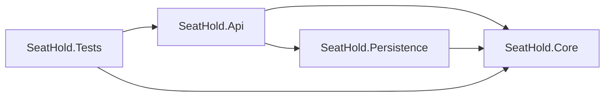
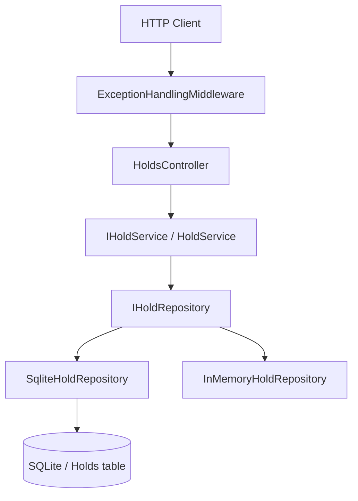
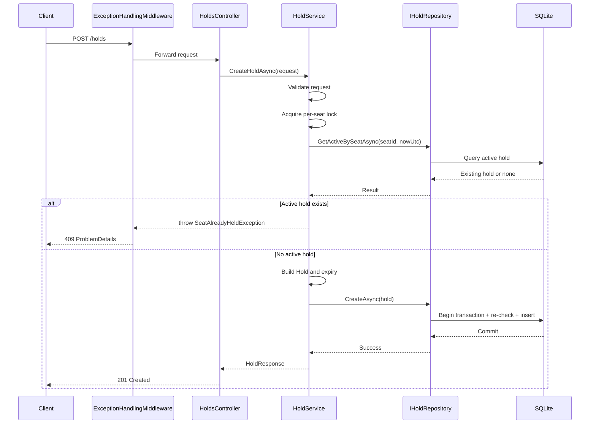
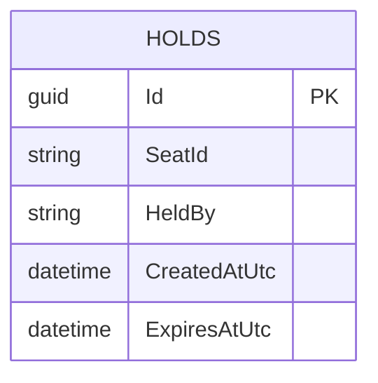

# SeatHoldApi Architecture

## Overview

`SeatHoldApi` is a small ASP.NET Core 8 solution built around a single use case: creating and querying temporary seat holds.

The design is intentionally simple:

- `SeatHold.Api` owns HTTP concerns and app startup.
- `SeatHold.Core` owns business rules and domain contracts.
- `SeatHold.Persistence` owns the EF Core + SQLite implementation.
- `SeatHold.Tests` covers service behavior and end-to-end API behavior.

The code follows a straightforward dependency direction:

`Api -> Core <- Persistence`

The API depends on `Core` for service contracts and behavior, and on `Persistence` for the concrete repository implementation. `Core` stays framework-light and does not depend on the web layer or EF Core.

## Solution Structure

## Runtime Design

At runtime, requests enter through the ASP.NET Core host, pass through exception handling middleware, and then reach thin controllers. Controllers delegate immediately to the service layer. The service layer owns validation and seat-hold rules, while the repository handles storage details.

The current default persistence provider is SQLite via EF Core. There is also a simple in-memory fallback that can be selected through configuration for lightweight scenarios.

## Project Details

### SeatHold.Api

`SeatHold.Api` is the host application. It is responsible for:

- ASP.NET Core startup and dependency injection
- controller endpoints
- middleware registration
- Swagger/OpenAPI setup
- database initialization on startup for the SQLite path
- selecting the persistence provider from configuration

Key pieces:

- `Program.cs` builds the web app, registers services, and runs EF Core migrations when SQLite is enabled.
- `Extensions/ServiceCollectionExtensions.cs` wires up the clock, service layer, middleware, and repository implementation.
- `Controllers/HoldsController.cs` exposes the public API:
  - `POST /holds`
  - `GET /holds/{id}`
  - `GET /holds?status=active|expired`
- `Middleware/ExceptionHandlingMiddleware.cs` converts domain exceptions into `ProblemDetails` responses.

The controller is intentionally thin. It does not contain business rules. Its job is request parsing, simple query validation, and translating service results into HTTP responses.

### SeatHold.Core

`SeatHold.Core` contains the application logic and the core abstractions the rest of the solution is built around.

Contents:

- contracts used at the API boundary
- domain model for a hold
- business exceptions
- service interface and implementation
- repository abstraction
- clock abstraction
- an in-memory repository implementation

Important design points:

- `HoldService` is the main application service.
- `IHoldRepository` is the single persistence abstraction.
- `ISystemClock` keeps time handling explicit and testable.
- `Hold` is the internal domain model.
- `HoldResponse.IsActive` is derived from `ExpiresAtUtc > nowUtc`; it is not stored.

The core business rules live here:

- request validation (`SeatId`, `HeldBy`, and positive `DurationMinutes`)
- trimming input values
- enforcing one active hold per seat
- calculating `CreatedAtUtc` and `ExpiresAtUtc` using UTC only
- calculating active vs expired status at read time

`HoldService` also uses a per-seat in-process lock (`ConcurrentDictionary<string, SemaphoreSlim>`) to avoid overlapping writes for the same seat inside a single app instance before persistence is called.

### SeatHold.Persistence

`SeatHold.Persistence` contains the EF Core implementation of `IHoldRepository`.

Main components:

- `SeatHoldDbContext`
- `HoldEntity`
- `SqliteHoldRepository`
- `ServiceCollectionExtensions`
- `SeatHoldDbContextFactory` for design-time EF tooling

`SeatHoldDbContext` maps a single table, `Holds`, with:

- `Id` as the primary key
- required `SeatId`
- required `HeldBy`
- required `CreatedAtUtc`
- required `ExpiresAtUtc`
- an index on `SeatId`
- a composite index on `(SeatId, ExpiresAtUtc)`

`SeatId` uses `NOCASE` collation so lookups remain case-insensitive at the database level, which aligns with the in-memory behavior and the service lock dictionary.

`SqliteHoldRepository` is intentionally small. It does not try to own business rules, but it does add one defensive consistency check during `CreateAsync`:

- begin a transaction
- re-check whether the seat already has an active hold using the repository clock
- insert the new row only if no active hold exists

That second check closes the gap between service-level validation and database write time, which matters for SQLite when multiple requests hit the same seat close together.

### SeatHold.Tests

`SeatHold.Tests` keeps the test strategy split into two levels:

- unit tests for core business logic
- integration tests for the full HTTP pipeline

Unit tests:

- exercise `HoldService` directly
- use `InMemoryHoldRepository`
- use a fake clock to make time-based logic deterministic
- verify validation, expiry calculation, conflict behavior, and filtering

Integration tests:

- use `WebApplicationFactory<Program>`
- start the actual API host
- call endpoints over HTTP
- point SQLite at a temp database per test to avoid cross-test contamination
- verify persistence across host restart in the SQLite path

This split keeps the important rules fast to test in isolation while still proving the host, DI, middleware, and persistence wiring work together.

## Request Flow

The main write path is short and easy to follow.

The read path is simpler:

- controller loads by id or list filter
- service reads from the repository
- service computes `IsActive` using the current UTC time
- controller returns `200 OK` or `404 Not Found`

## Error Handling

The solution keeps error translation in one place: `ExceptionHandlingMiddleware`.

Current mappings:

- `InvalidHoldRequestException` -> `400 Bad Request`
- `SeatAlreadyHeldException` -> `409 Conflict`
- unexpected exceptions -> `500 Internal Server Error`

All mapped errors return `ProblemDetails`, which keeps API behavior consistent without duplicating try/catch logic in controllers.

## Configuration

The main runtime settings live in `SeatHold.Api/appsettings.json`.

Relevant settings:

- `Persistence:Provider`
  - `Sqlite` (default)
  - `InMemory`
- `ConnectionStrings:SeatHoldDb`
  - defaults to `Data Source=seathold.db`

This keeps the app easy to run locally while still allowing tests or local debugging to swap persistence without changing code.

## Data Model

The persisted data model is intentionally narrow. A hold is stored as a single row.

Notably absent:

- no persisted `IsActive`
- no soft-delete flags
- no separate seat catalog
- no audit/event tables

That is deliberate. The current exercise only needs temporary holds, and derived state is computed on demand from UTC timestamps.

## Design Notes

This solution is intentionally not over-engineered.

- There is one service with one repository abstraction.
- Domain rules stay in the service layer, not the controller and not EF Core.
- Persistence is replaceable, but only through a single interface that is already justified by tests and the in-memory option.
- Time is abstracted once with `ISystemClock`, which keeps the time-based rules easy to test.

In short, this is a small layered service, not a platform. The architecture is built to keep the business rule easy to reason about: a seat can have at most one active hold at a time, and active status is always determined from the current UTC time.

## Evolution of the Solution

V1: In-memory repository focused on correctness and rule enforcement.

V2: Contract validation using Postman/Newman integrated into CI.

V3: SQLite persistence using EF Core, migrations, and request-scoped services without changing the API contract.